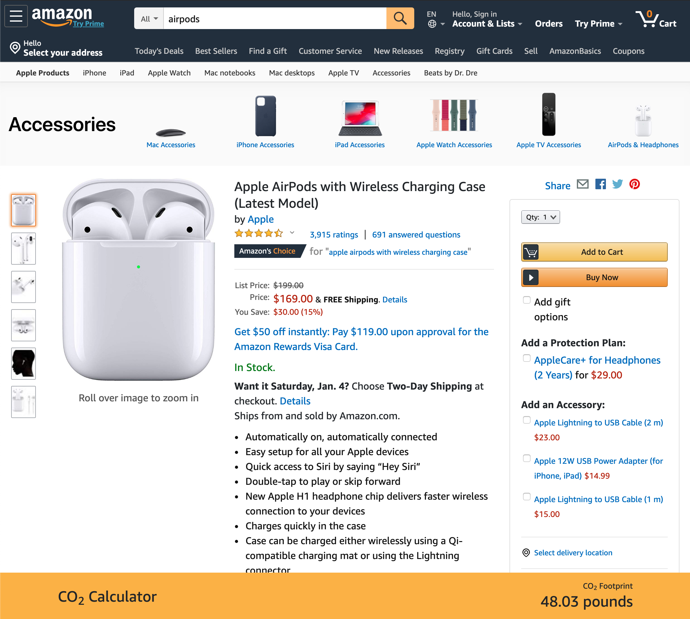

Welcome to the Carbon Calculator Blog. Allow me to introduce myself: I'm Mike, and I'll be working on improving Carbon Calculator for the next few months.

### How Did This Get Started?

Last year was a watershed year for the climate movement. Advocates like [Greta Thunberg](https://twitter.com/GretaThunberg) and organizations like [Sunshine Movement](https://www.sunrisemovement.org) showed that the climate crisis could—and should—be the top-tier issue of our time. While the increase in attention has made more people aware of the crisis, it's clear that we're running out of time.

As someone who has spent much of his life not recycling, not shopping mindfully, and generally not worrying about the climate, I've found that I need to change my thinking and make up for lost time. I've reduced my meat consumption, begun composting, and now shop in second-hand stores instead of buying new. Though these steps are significant, I know there's a lot more to do.

One of my particular weaknesses is online shopping. I began wondering about just how much carbon was released each time I clicked "Buy Now." I came across [Amazon's Carbon Methodology Paper](https://d39w7f4ix9f5s9.cloudfront.net/a4/ad/b9eca67e4578b35e8f995c8b4f9c/amazon-carbon-methodology-september-2019.pdf) which arrives at a carbon emission rate per dollar spent: 128 grams of CO2/USD. In the abstract this is useful, but I think my _aha moment_ came when I was looking at a pair of Apple AirPods. I realized that if I bought them I'd also be buying 48 pounds of carbon (~21 kg for those of you who prefer the metric system). I wanted to get this information on all of the pages I was browsing and started developing Carbon Calculator.

### How Does It Work?

Carbon Calculator at launch only works on Amazon.com pages (that means it's US only for now). Once you install the extension in Chrome ([instructions here](/extension)) you'll get a banner at the bottom Amazon product pages estimating the item's carbon footprint. I'm working hard on bringing this technology to other websites.

Here's what Carbon Calculator looks like once you've installed it:

### Will This Solve the Climate Crisis?

No! Let's disabuse ourselves of any notion that this will solve the climate crisis. Carbon Calculator is meant only to be informational and to hopefully nudge users towards purchasing less. My hope is that everyone who uses Carbon Calculator will think twice next time they make an impulsive Amazon/Walmart/Target purchase, and that together we can begin to be more mindful of our purchases.
